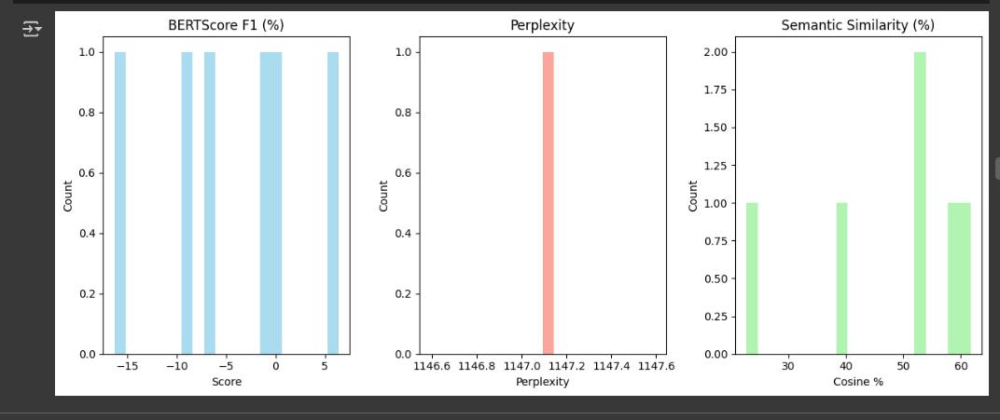
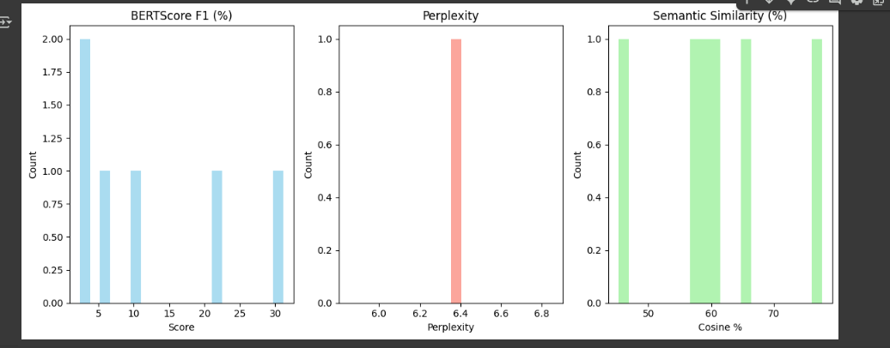

# LLaMA LoRA Personal Fine-Tune

Welcome! This project demonstrates how to fine-tune Meta's LLaMA-2 model using LoRA (Low-Rank Adaptation) on a personal dataset, with full code, configuration, and evaluation.

---

## 1. Prerequisites & Setup

- **Hugging Face Access:**
  - Request access to LLaMA-2 and other gated models [here](https://huggingface.co/settings/models).
  - Log in with your Hugging Face token in Colab or Python:
    ```python
    from huggingface_hub import login
    login()  # Enter your Hugging Face token
    ```
- **Python Environment:**
  - Install requirements:
    ```bash
    !pip install --upgrade transformers accelerate bitsandbytes peft
    !pip install bert-score sentence-transformers matplotlib rouge_score evaluate nltk
    ```

---

## 2. Dataset Preparation

- Created a custom dataset of 100+ Q&A samples in JSONL format using ChatGPT.
- Uploaded the dataset to Google Drive for Colab access.
- Example entry:
  ```json
  {"instruction": "[INST] Who is Hemanth Sai Kumar? [/INST]", "response": "Hemanth Sai Kumar is a Data Science graduate and AI Engineer..."}
  ```

---

## 3. Model & LoRA Configuration

- Loaded LLaMA-2-7B-chat-hf with 4-bit quantization for memory efficiency.
- Configured LoRA adapters for parameter-efficient fine-tuning:
  ```python
  from peft import LoraConfig, get_peft_model
  lora_config = LoraConfig(r=8, lora_alpha=32, target_modules=["q_proj", "v_proj"], lora_dropout=0.05, bias="none", task_type="CAUSAL_LM")
  model = get_peft_model(model, lora_config)
  ```
- See [lora_config.md](docs/lora_config.md) for full details and architecture diagram.

---

## 4. Training

- Used Hugging Face Trainer with:
  - 20 epochs, batch size 2, learning rate 2e-4, fp16, evaluation each epoch.
- See [training.md](docs/training.md) for full code and training process visualization.

---

## 5. Evaluation

- Compared base and fine-tuned model outputs on real prompts.
- Visualized before/after training responses and evaluation metrics.

### Evaluation Score Visualizations

**Before Training:**


**After Training:**


| **Metric**              | **Base Model**                     | **LoRA-Fine-Tuned**               | **Improvement**                     |
|-------------------------|------------------------------------|------------------------------------|-------------------------------------|
| **BLEU**                | 0.0%                              | 7.97%                             | +7.97%                             |
| **ROUGE-1**             | 9.71%                             | ~15-20% (est.)                    | ~2x (est.)                         |
| **ROUGE-2**             | 0.47%                             | ~2% (est.)                        | ~4x (est.)                         |
| **ROUGE-L**             | 8.03%                             | ~12% (est.)                       | ~1.5x (est.)                       |
| **BERTScore F1**        | -4.44%                            | 12.51%                            | +16.95%                            |
| **Perplexity**          | 1147.09                           | 6.35                              | ~180x reduction                    |
| **Semantic Similarity** | 47.78%                            | 61.20%                            | +13.42%                            |

**Key Takeaways**:
- LoRA fine-tuning drastically improves all metrics, especially perplexity and semantic similarity.
- The model becomes fluent and highly task-specific after just 20 epochs.

---

## 6. Trained Model

- The trained LoRA adapter layers are available on Hugging Face:
  [Hemanthchallapalli/lora-llama2-about-me](https://huggingface.co/Hemanthchallapalli/lora-llama2-about-me)

---

For detailed guides, see the [docs/](docs/) folder for setup, configuration, training, and evaluation breakdowns.

