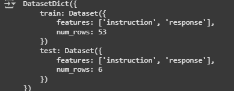

## Dataset Preparation

The dataset for this project was prepared by using ChatGPT to generate user questions such as "Who am I?" and similar queries. Each sample was formatted in JSONL, where each line contains an instruction and a corresponding response. For example:

```json
{"instruction": "[INST] How did Hemanth Sai Kumar improve customer support efficiency? [/INST]", "response": "He reduced customer support response times by 40% through the development of LangChain-powered AI agents."}
```

Following this approach, at least 100 such samples were created and saved as a `.jsonl` file in the repository. This dataset serves as the foundation for fine-tuning the model on personalized instructions and responses.

After creating the dataset, it was uploaded to Google Drive to enable easy access from Google Colab for training and experimentation.

---

## Using the Dataset in Google Colab

### 1. Uploading the Dataset

1. Create a folder in your Google Drive (e.g., `langgraph_dataset`).
2. Upload your `.jsonl` dataset file (e.g., `about_me2.jsonl`) into this folder.

### 2. Reading the Dataset

```python
import pandas as pd
from datasets import Dataset

# Load JSONL dataset
dataset = pd.read_json("/content/drive/MyDrive/langgraph_dataset/about_me2.jsonl", lines=True)

# Convert to Hugging Face Dataset
hf_dataset = Dataset.from_pandas(dataset)

# Split into train & eval
hf_dataset = hf_dataset.train_test_split(test_size=0.1)
```

### 3. Processing the Dataset

```python
def format_example(example):
	prompt = example["instruction"]
	answer = example["response"]
	text = f"{prompt}\n{answer}"
	return {"text": text}

processed_dataset = hf_dataset.map(format_example)

def tokenize(batch):
	return tokenizer(batch["text"], padding="max_length", truncation=True, max_length=512)

tokenized_dataset = processed_dataset.map(tokenize, batched=True)
```

### 4. Inspecting the Data

To view a sample from the training set:

```python
hf_dataset['train'][0]
```

Example output:
```json
{
	'instruction': '[INST] What tech stack did Hemanth use at Visusoft? [/INST]',
	'response': 'He used FastAPI, React, Angular, Node.js, PostgreSQL, MongoDB, PyTorch, and Hugging Face Transformers.'
}
```

To view the dataset structure:

```python
hf_dataset
```

Example output:




