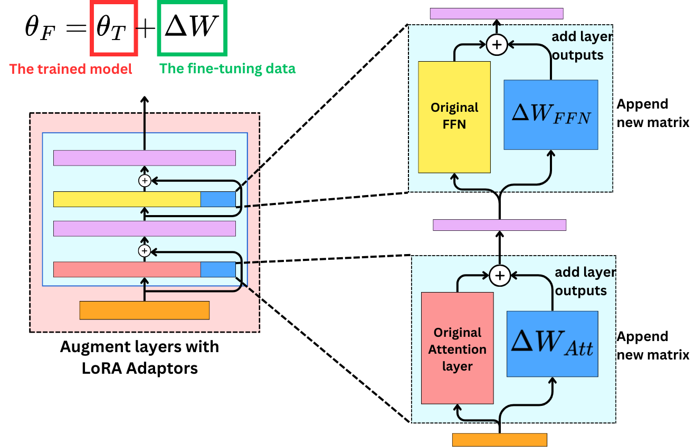

# LoRA Configuration for LLaMA-2 Fine-Tuning

LoRA (Low-Rank Adaptation) enables parameter-efficient fine-tuning of large language models like LLaMA-2 by injecting trainable low-rank matrices into each layer, drastically reducing the number of trainable parameters.

---

## 1. Install PEFT

```bash
!pip install peft
```

---

## 2. Model and Tokenizer Loading

```python
from transformers import AutoTokenizer, AutoModelForCausalLM, BitsAndBytesConfig

quant_config = BitsAndBytesConfig(
	load_in_4bit=True,
	bnb_4bit_compute_dtype=torch.float16
)

model = AutoModelForCausalLM.from_pretrained(
	"meta-llama/Llama-2-7b-chat-hf",
	quantization_config=quant_config,
	device_map="auto",
	token=token
)

tokenizer = AutoTokenizer.from_pretrained(
	"meta-llama/Llama-2-7b-chat-hf",
	use_fast=False,
	token=token
)
tokenizer.pad_token = tokenizer.eos_token
```

---

## 3. LoRA Configuration

```python
from peft import LoraConfig, get_peft_model

lora_config = LoraConfig(
	r=8,
	lora_alpha=32,
	target_modules=["q_proj", "v_proj"],  # LLaMA uses q_proj, v_proj
	lora_dropout=0.05,
	bias="none",
	task_type="CAUSAL_LM"
)

model = get_peft_model(model, lora_config)
model.print_trainable_parameters()
```

**Explanation:**
- `r`: LoRA rank (controls the size of the injected matrices)
- `lora_alpha`: Scaling factor for LoRA updates
- `target_modules`: Which modules to adapt (for LLaMA, use `q_proj` and `v_proj`)
- `lora_dropout`: Dropout for LoRA layers
- `bias`: Whether to adapt bias terms
- `task_type`: Type of task (here, causal language modeling)

---

## 4. Training Arguments and Trainer Setup

```python
from transformers import TrainingArguments, Trainer, DataCollatorForLanguageModeling

training_args = TrainingArguments(
	output_dir="./lora-llama2-about_me",
	per_device_train_batch_size=2,
	gradient_accumulation_steps=4,
	learning_rate=2e-4,
	num_train_epochs=20,
	logging_steps=10,
	save_strategy="epoch",
	eval_strategy="epoch",
	fp16=True,
	push_to_hub=False
)

data_collator = DataCollatorForLanguageModeling(tokenizer, mlm=False)

trainer = Trainer(
	model=model,
	args=training_args,
	train_dataset=tokenized_dataset["train"],
	eval_dataset=tokenized_dataset["test"],
	data_collator=data_collator
)
```

---


## LoRA Architecture Diagram

Below is a visual representation of how LoRA adapts the model's architecture by injecting low-rank adapters into the attention layers:



**Diagram Explanation:**
- LoRA inserts small trainable matrices (A and B) into the attention layers (e.g., q_proj, v_proj) of the base model.
- During fine-tuning, only these adapters are updated, while the original model weights remain frozen.
- This approach drastically reduces the number of trainable parameters, making fine-tuning feasible on consumer hardware.

---


---

**Previous:** [Setup](setup.md)

**Next:** [Training](training.md)