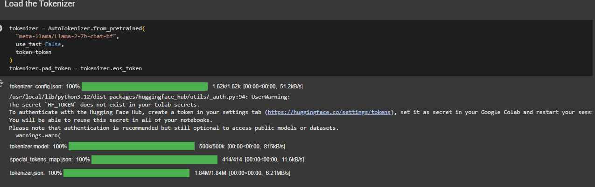
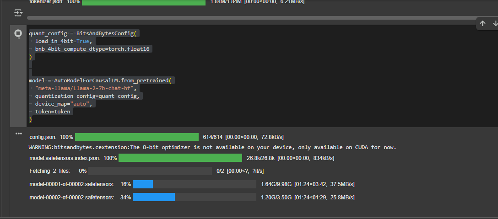

# Environment and Model Setup

This section guides you through verifying your GPU, setting up your Hugging Face token, and loading the LLaMA-2 model and tokenizer for inference.

## 1. Import Required Libraries

```python
import torch
from transformers import AutoTokenizer, AutoModelForCausalLM, BitsAndBytesConfig
from huggingface_hub import login
from google.colab import userdata
import os
```

## 2. Verify GPU Availability

Before running large models, ensure your environment has a GPU:

```python
print(f"CUDA Available: {torch.cuda.is_available()}")
print(f"CUDA Version: {torch.version.cuda}")
print(f"GPU Name: {torch.cuda.get_device_name(0)}")
print(f"GPU Memory Total: {torch.cuda.get_device_properties(0).total_memory / 1024**3:.2f} GB")
```

## 3. Set Up Hugging Face Token

You need a Hugging Face access token to download the LLaMA-2 model. Get your token from https://huggingface.co/settings/tokens and set it as an environment variable:

```python
# If using Colab secrets (recommended for privacy):
token = userdata.get('HF_TOKEN')  # Store your token in Colab secrets
os.environ["HF_TOKEN"] = token

# Or, if running locally, you can set it directly:
# os.environ["HF_TOKEN"] = "your_hf_token_here"

# Login to Hugging Face Hub (optional, but recommended)
login(token=token)
```

## 4. Load the Tokenizer

```python
tokenizer = AutoTokenizer.from_pretrained(
	"meta-llama/Llama-2-7b-chat-hf",
	use_fast=False,
	token=token
)
tokenizer.pad_token = tokenizer.eos_token  # Set padding token
```



## 5. Configure 4-bit Quantization (for Efficient Inference)

```python
quant_config = BitsAndBytesConfig(
	load_in_4bit=True,
	bnb_4bit_compute_dtype=torch.float16
)
```

**Why use 4-bit quantization?**

4-bit quantization (using `BitsAndBytesConfig`) allows you to load large language models like LLaMA-2 on GPUs with limited memory (such as 12–16GB VRAM). By reducing the precision of model weights from 16 or 32 bits down to 4 bits, you can:
- Fit larger models on your hardware
- Reduce memory usage and speed up inference
- Maintain good performance for most generation tasks

This is especially useful when working in environments like Google Colab or on consumer GPUs.
```

## 6. Load the Model

```python
model = AutoModelForCausalLM.from_pretrained(
	"meta-llama/Llama-2-7b-chat-hf",
	quantization_config=quant_config,
	device_map="auto",
	token=token
)
```

this may take few minutes



## 7. Generate Text with the Model

Define a function to generate text from a prompt:

```python
def generate(model, tokenizer, prompt, max_new_tokens=50):
	inputs = tokenizer(prompt, return_tensors="pt", padding=True).to("cuda")
	with torch.no_grad():
		outputs = model.generate(
			**inputs,
			max_new_tokens=max_new_tokens,
			do_sample=True,
			top_p=0.95,
			temperature=0.7,
			pad_token_id=tokenizer.eos_token_id
		)
	return tokenizer.decode(outputs[0], skip_special_tokens=True)

# Example usage:
prompt = "[INST] What is LlamaIndex? [/INST]"
generated_text = generate(model, tokenizer, prompt)
print(generated_text)
```

---

# 8. Save the Model and Tokenizer for Future Use

After loading the model and tokenizer, you can save them to your Google Drive. This way, you won’t need to download and load them from Hugging Face again, saving time and bandwidth in future sessions.

```python
# Save model and tokenizer to Google Drive
save_path = "/content/drive/MyDrive/llama2_model_saved"
model.save_pretrained(save_path)
tokenizer.save_pretrained(save_path)
```

**Tip:** Next time, you can load the model and tokenizer directly from this folder:

```python
from transformers import AutoTokenizer, AutoModelForCausalLM
model = AutoModelForCausalLM.from_pretrained(save_path, device_map="auto")
tokenizer = AutoTokenizer.from_pretrained(save_path)
```

This avoids repeated downloads and speeds up your workflow in Colab or any environment with persistent storage.


## Code Explanation

- **Imports:** Loads all necessary libraries for model loading, quantization, and authentication.
- **GPU Verification:** Ensures your environment is using a GPU for faster inference.
- **Hugging Face Token:** Required to access gated models like LLaMA-2. Use Colab secrets or set as an environment variable.
- **Tokenizer & Model Loading:** Downloads and prepares the tokenizer and model from Hugging Face. 4-bit quantization is used for memory efficiency.
- **Text Generation:** The `generate` function takes a prompt and returns the model's response.


---

**Previous:** [Project Overview](index.md)

**Next:** [LoRA Configuration](lora_config.md)
