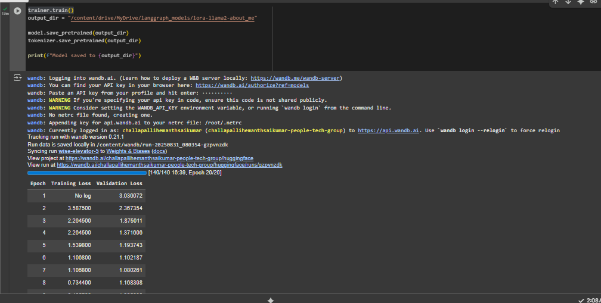

---

**Previous:** [LoRA Configuration](lora_config.md)

**Next:** [Evaluation](evaluation.md)

# Training LoRA-Fine-Tuned LLaMA-2

This section covers how to set up and launch the training process for your LoRA-adapted LLaMA-2 model.

---

## 1. Training Arguments and Trainer Setup

```python
from transformers import TrainingArguments, Trainer, DataCollatorForLanguageModeling

training_args = TrainingArguments(
	output_dir="./lora-llama2-about_me",
	per_device_train_batch_size=2,
	gradient_accumulation_steps=4,
	learning_rate=2e-4,
	num_train_epochs=20,
	logging_steps=10,
	save_strategy="epoch",
	eval_strategy="epoch",
	fp16=True,
	push_to_hub=False
)

data_collator = DataCollatorForLanguageModeling(tokenizer, mlm=False)

trainer = Trainer(
	model=model,
	args=training_args,
	train_dataset=tokenized_dataset["train"],
	eval_dataset=tokenized_dataset["test"],
	data_collator=data_collator
)
```

---

## 2. Start Training

```python
trainer.train()
```

---

## Training Process Visualization

Below is a diagram illustrating the LoRA fine-tuning training workflow:



---


